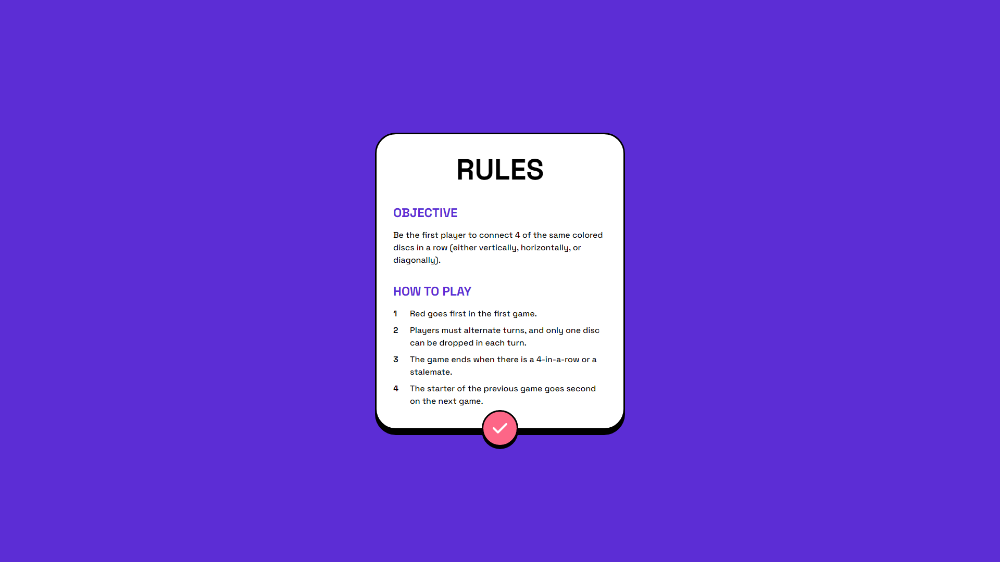

# Connect Four Game

This is a solution to Frontend Mentor's [Connect Four game challenge](https://www.frontendmentor.io/challenges/connect-four-game-6G8QVH923s) with bonus added functionality.

## Links

- [Live Link](https://connect-four-game-omaralseddik.vercel.app/)
- [Solution Link](https://www.frontendmentor.io/solutions/nextjs-typescript-tailwind-framermotion-with-minimax-ai-8_2kup5D39)

## Features

- Fully functional connect-four game.
- Option to play against another player (on the same device) or against the AI.
- The AI utilizes the minimax algorithm to play the most optimal moves. There are 3 different difficulty levels to choose from!
- Page transition animations with animated elements.
- Fully responsive design.

## Tech Stack

- Next.js
- TypeScript
- Tailwind
- Framer Motion

## Desktop Screenshots

  
   
  

## Mobile Screenshots

  
   
  

